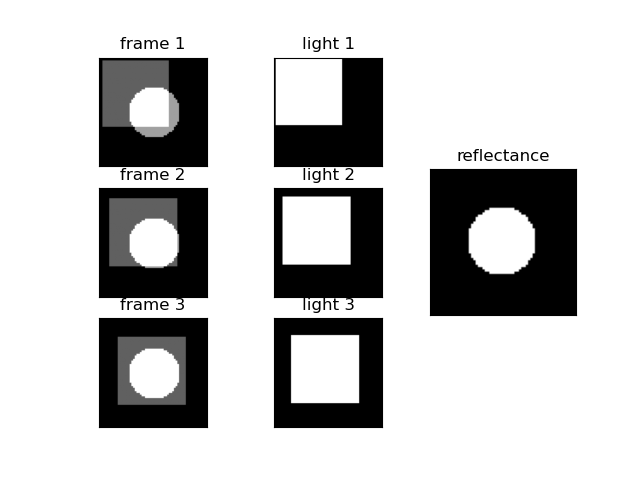

# Intrinsic Image Decomposition from Image Sequence
Python implementation of Y. Weiss, Deriving intrinsic images from image sequences. In Proc. Int. Conf. on Computer Vision (ICCV), volume 2, pages 68-75, 2001

## requirement
Implemented with libraries of version in ```requirement.txt```

```pip install -r requirement.txt```

## usage
reproduce example similar to figure 4 in the paper

```python demo.py```

<p align="center">
 
</p>

if you have a directory(folder) containing image sequence:

```python demo.py --dir [DIR_PATH]```

repalce ```DIR_PATH``` with yours

if you have folder structure like:

folder0
- folder1
    - img0
    - img1
    - ...
- folder2
    - img0
    - img1
    - ...
- ...

you can use ```save.py``` as below:

```python save.py --input-dir [INPUT_DIR_PATH] --output-dir [OUTPUT_DIR_PATH]```

## reference
- [Y. Weiss, Deriving intrinsic images from image sequences. In Proc. Int. Conf. on Computer Vision (ICCV), volume 2, pages 68-75, 2001](https://www.cs.huji.ac.il/w~yweiss/iccv01.pdf)
- [matlab code of demo](https://www.cs.huji.ac.il/w~yweiss/intrinsic.tar) (*download will start if you click*)

