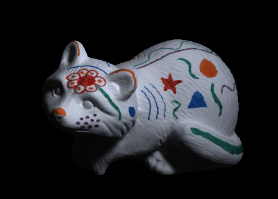
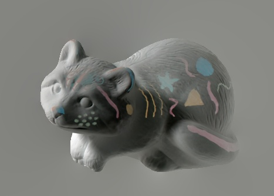
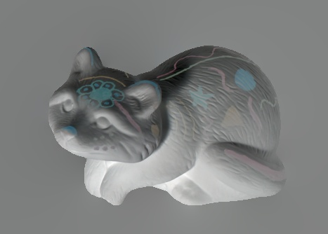

# Intrinsic Image Decomposition from Image Sequence
Python implementation of Y. Weiss, Deriving intrinsic images from image sequences. In Proc. Int. Conf. on Computer Vision (ICCV), volume 2, pages 68-75, 2001

## requirement
Implemented with libraries of version in ```requirement.txt```

```bash
pip install -r requirement.txt
```

## usage
reproduce example similar to figure 4 in the paper

```bash
python demo.py
```

<p align="center">
 
</p>

if you have a directory(folder) containing image sequence:

```bash
python demo.py --dir [DIR_PATH]
```

repalce ```DIR_PATH``` with yours.

For example, below is the part of given sequences from [MIT Intrinsic Images dataset](https://www.cs.toronto.edu/~rgrosse/intrinsic/):

<p align="center">
    
    
    
    
</p>

At the below, left is the ground truth and right is derived by algorithm:

<p align="center">
    
    
</p>

And, here is the illumination calculated using derived reflectance:

<p align="center">
    
    
    
    
</p>

if you have folder structure like:

folder0
- folder1
    - img0
    - img1
    - ...
- folder2
    - img0
    - img1
    - ...
- ...

you can use ```save.py``` as below:

```bash
python save.py --input-dir [INPUT_DIR_PATH] --output-dir [OUTPUT_DIR_PATH]
```

## reference
- [Y. Weiss, Deriving intrinsic images from image sequences. In Proc. Int. Conf. on Computer Vision (ICCV), volume 2, pages 68-75, 2001](https://www.cs.huji.ac.il/w~yweiss/iccv01.pdf)
- [matlab code of demo](https://www.cs.huji.ac.il/w~yweiss/intrinsic.tar) (*download will start if you click*)
- [Roger Grosse, Micah K. Johnson, Edward H. Adelson, and William T. Freeman, Ground truth dataset and baseline evaluations for intrinsic image algorithms, in Proceedings of the International Conference on Computer Vision (ICCV), 2009](https://www.cs.toronto.edu/~rgrosse/iccv09-intrinsic.pdf)